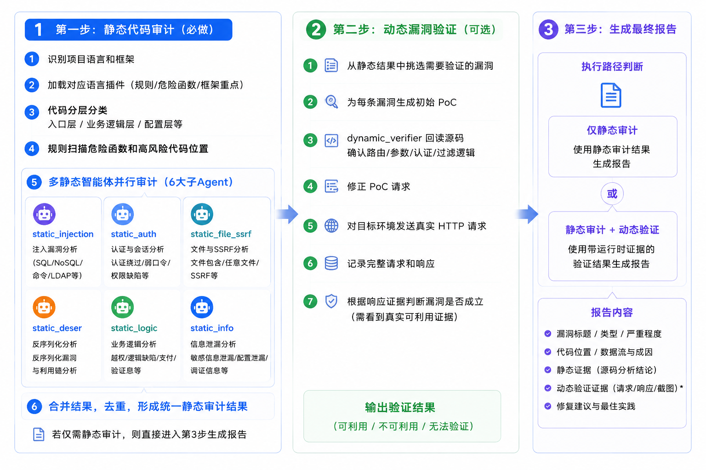

# Vibe CSA

> 当前版本：v1.0.3

Vibe CSA (Code Security Audit) ，是一款基于 AI Agent 架构的代码审计工具，采用多 Agent 并行执行架构，用“上帝视角”静态审计源代码，用“实战模拟”动态验证漏洞，保证了web漏洞挖掘的全面性和准确性，输出稳定可靠的安全报告，提供可落地整改建议。主要能力：AI 代码审计和 AI 漏洞评估。

项目特点：
- `Stage 1`：基于源码和语言插件做静态审计
- `Stage 2`：基于静态 finding 做单漏洞动态验证，支持最多 5 个 `dynamic-verifier` 并行处理
- `Stage 3`：生成标准 JSON，并导出 HTML / Word 报告

## 目录

- [适合谁](#适合谁)
- [注意事项](#注意事项)
- [环境运行依赖](#环境运行依赖)
- [执行步骤](#执行步骤)
- [Multi-Agent](#multi-agent)
- [提示词示例](#提示词示例)
- [报告生成说明](#报告生成说明)
- [流程示意图](#流程示意图)

## 适合谁

适合以下两类用户：
- 适合软件开发人员，用于web相关的安全自检
- 适合网络安全从业者，用于第三方的web安全检测

如果您是第一次接触这个项目，可以先把它理解为：
- `SKILL.md`：AI Agent 的主协议入口
- `core/`：阶段规则、证据契约、报告规范
- `plugins/`：按语言加载的静态审计规则
- `scripts/`：辅助脚本，负责合并结果、初始化 PoC、验证请求、校验和导出报告

使用AI智能体，加载此技能，配合本技能包含的检测脚本
- 3分钟使用教程视频：[bilibili.com/video/BV1RiGX6rESQ/](https://www.bilibili.com/video/BV1RiGX6rESQ/)
- 优先推荐编程类智能体：Qoder、Trae、Claude Code、Codex 等
- 次选：龙虾类智能体


## 注意事项

- 仅用于授权的安全测试，请勿用于非法用途
- 不建议直接对生产系统做动态验证；如必须测试，请先做好隔离和备份
- `Stage 2` 需要目标 URL；若接口需要登录态，还需要准备凭证或人工登录会话


## 环境运行依赖

### Python

建议使用 Python 3.10+

安装依赖：
```bash
pip install -r vibe-csa/scripts/requirements.txt
```

需要的 Python 包：
- `jsonschema`
- `requests`
- `urllib3`
- `python-docx`
- `matplotlib`
- `httpx`
- `charset-normalizer`
- `chardet`

### 多Agent智能体

创建多智能体，可有效提高代码审计、漏洞验证的速度和质量
- 自动创建子 Agent 可参考 `core/multi-agent.md`
- 手工创建子 Agent 提示词模板可参考 `sub_agent.md`

## 执行步骤

### 1. 静态审计

多 agent 并行分析源码，输出单个 finding JSON 到 `workDir/agent-results/`，再合并为 `workDir/static-merged.json`。

### 2. 动态验证

可选。根据静态结果生成 PoC，在目标环境中验证漏洞是否真实存在；Stage 2 会先生成 `workDir/findings/FINDING-*.json` 和 `workDir/dynamic-state.json`，再由并行 `dynamic-verifier` 逐条验证，最终输出 `workDir/dynamic-verified.json`。

### 3. 最终报告

最终 JSON 生成后，再导出 HTML 和 Word 报告。

## Multi-Agent

推荐的静态 agent 分工：

- `static-injection`：注入类问题
- `static-auth`：认证、授权、会话
- `static-file-ssrf`：文件操作、SSRF、上传
- `static-deser`：反序列化、JNDI
- `static-logic`：业务逻辑、CSRF、状态流
- `static-info`：信息泄露、加密、配置问题

动态验证 agent：
- `dynamic-verifier`：一次只处理单个 finding，按 `workDir/dynamic-state.json` 队列领取任务并回写对应的 `workDir/findings/FINDING-*.json`

为保证效果，建议您在 AI Agent 平台上创建这些子 Agent，建议先参考根目录下的 `sub_agent.md`。该文档整理了各子 Agent 的英文标识名、调用时机，以及可直接复制使用的提示词模板。

## 提示词示例

### 静态审计提示词

```text
使用 `vibe-csa` 技能，对当前目录下的源码做静态审计，按 `core/static-multi-agent.md` 中的推荐 agent 分工，所有 agent 并发执行，每个 agent 独立生成 `workDir/agent-results/*.json` ，最后使用 `merge_static_results.py` 脚本汇总结果，生成 `workDir/static-merged.json`，并使用脚本去除重复漏洞项

将最终JSON报告生成 HTML 和 Word 报告：使用 `scripts/vibe_csa_html.py` 和 `scripts/vibe_csa_report.py` 脚本导出稳定的报告结果。
```

### 静态审计+动态漏洞验证提示词

```text
阶段一：静态审计 
使用 `vibe-csa` 技能，对当前目录下的源码做静态审计，按 `core/static-multi-agent.md` 中的推荐 agent 分工，所有 agent 并发执行，每个 agent 独立生成 `workDir/agent-results/*.json` ，最后使用 `merge_static_results.py` 脚本汇总结果，生成 `workDir/static-merged.json`，并使用脚本去除重复漏洞项

阶段二：动态漏洞验证
只对静态审计到的“严重/高危/抽样中危”的漏洞进行动态验证：先使用 `scripts/prepare_dynamic_pocs.py` 同时生成 `workDir/findings/FINDING-*.json` 和 `workDir/dynamic-state.json`，再根据 `core/dynamic-multi-agent.md` 创建 `1~5` 个 `dynamic-verifier` 子 Agent 并发执行漏洞验证，基于`dynamic-state.json` 的验证队列，逐条验证并回写对应 finding 文件；全部完成后，再使用脚本生成汇总生成 `workDir/dynamic-verified.json`

目标 URL: http://127.0.0.1:8056/admin.php?p=/Index/ucenter
授权声明: 已获得书面授权，授权范围包含该目标全部接口和页面
测试账号（1个）:
账号：admin
密码：123456
登录方式：你调用脚本打开浏览器，我手动输入账号密码登录

安全测试铁律：允许对测试过程中自己创建的数据、自己上传的文件、自己插入的记录做删除、更新、清理操作，以便验证删除/编辑/恢复/回收类漏洞；禁止对原始业务数据、他人数据、生产数据做破坏性操作。允许上传文件进行文件上传测试。

阶段三：报告生成
将最终JSON报告生成 HTML 和 Word 报告：使用 `scripts/vibe_csa_html.py` 和 `scripts/vibe_csa_report.py` 脚本导出稳定的报告结果。

```

## 报告生成说明

输出结果在`workDir`工作目录，可以使用以下命令手工执行报表生成：
静态审计 HTML 报告示例：
```bash
python scripts/vibe_csa_html.py -i workDir/static-merged.json -o workDir/reports/vibe-csa-static-{YYYYMMDD-HHmmss}.html
```

动态验证 Word 报告示例：
```bash
python scripts/vibe_csa_report.py -i workDir/dynamic-verified.json -o workDir/reports/vibe-csa-dynamic-{YYYYMMDD-HHmmss}.docx
```

## 流程示意图

